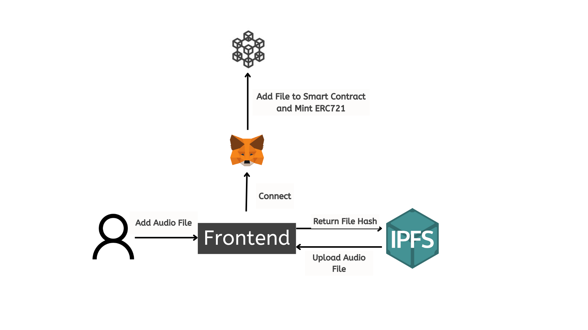
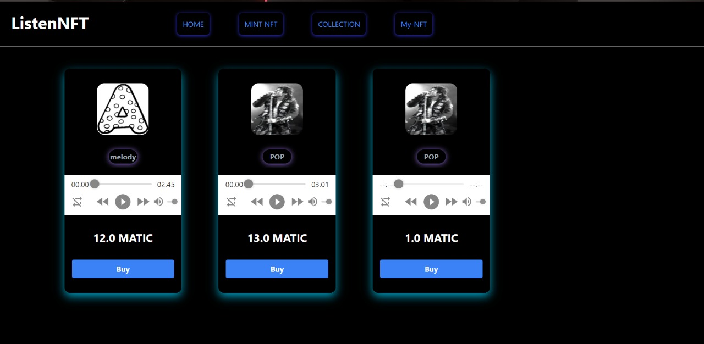
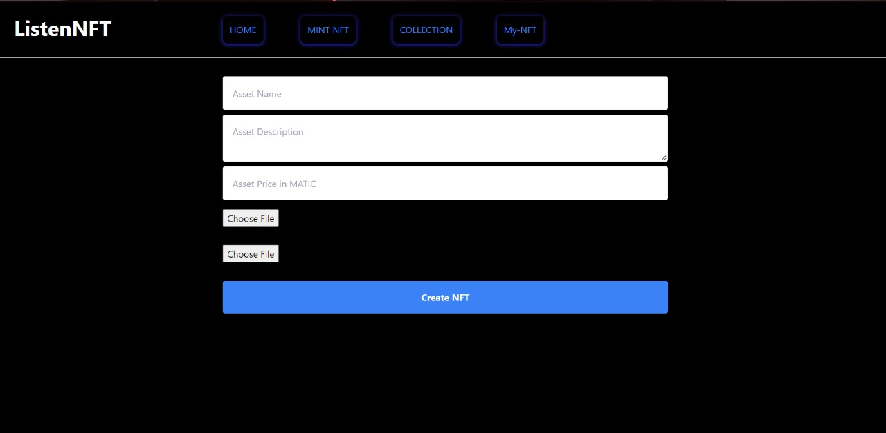
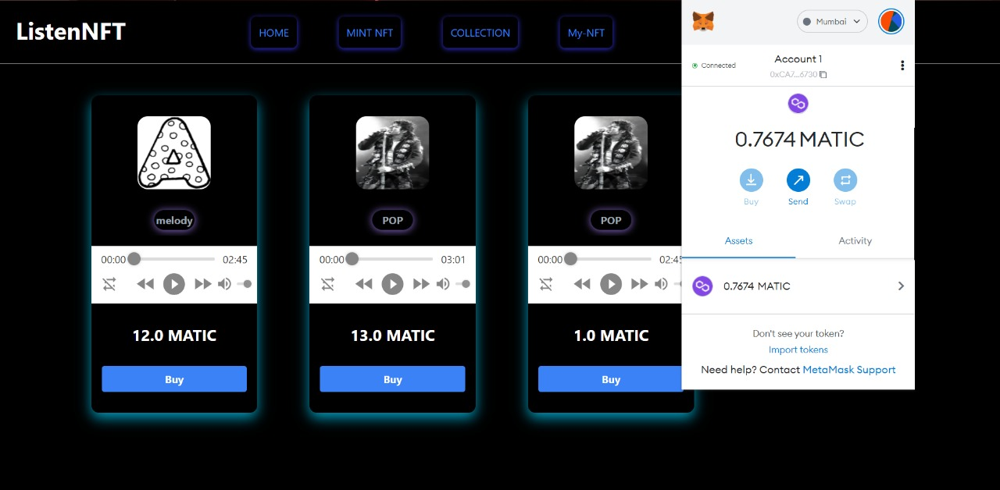
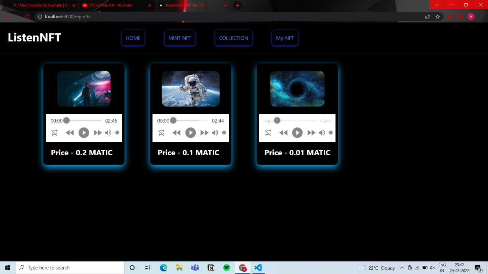

# ListenNFT

ListenNFT is a web3 music platform that makes the creator and user an ad-free platform. Any
music artist can mint their work and showcase it to the world with any intervention of Music
Studios.
Users can buy the music NFT to make it exclusive to pay the owner. 

# Tech Used

Solidity, Hardhat , Polygon, Alchemy, Ipfs

# Flow For Mint

# Problem It Solved

Artist don’t get the amount , importance and fame what they deserve. A huge amount is slashed by the big music firm like T-Series, Sony Music etc.

## Screenshots

